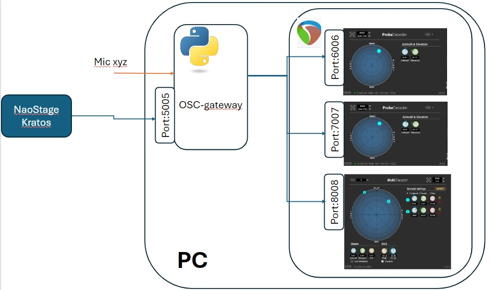
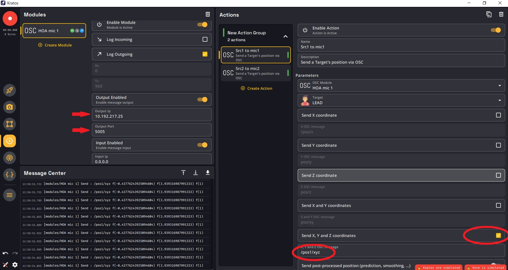
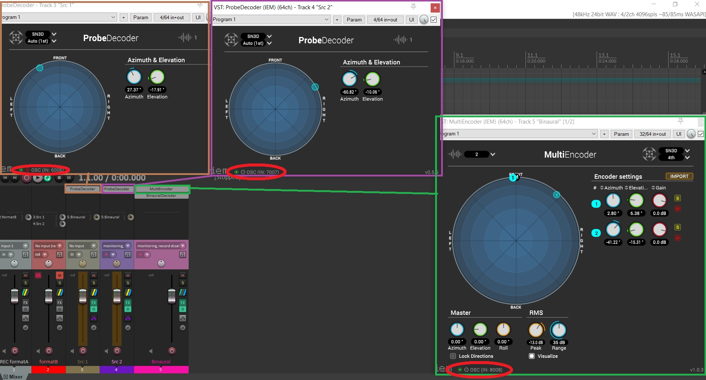

# Quick start

In your terminal, run the following lines to create the virtual environment and to install the needed packages:
~~~bash
py -u venv .venv  # Windows
python -u venv .venv  # Linux

pip install -r requirements.txt
~~~

Then, run `src/main.py`.

# Overview

# Kratos
In Kratos Actions panel:
* Add one `OSC module` per target computer:
    - Set the IP address of the target computer. I propose 10.192.217.XX in our LAN.
    - Set the port of the target computer. I propose 5005.
* Add two `OSC actions`:
    - Select the target OSC module.
    - Select the target character you want to track.
    - Check the box `Send X, Y, and Z coordinates`.
    - Set the `X, Y and Z OSC message` to `/pos1/xyz` or `/pos2/xyz`, respectively.

# Reaper

You can find the Reaper template session in the root of the project:  `beamforming_template.rpp`.
Add your ambisonic encoder plug-in in the `formatB` track FX.

